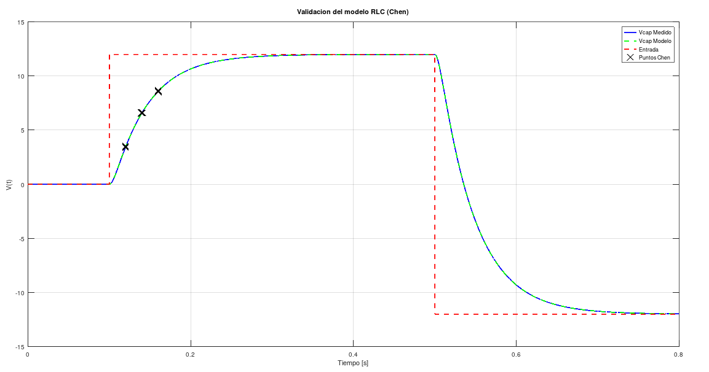
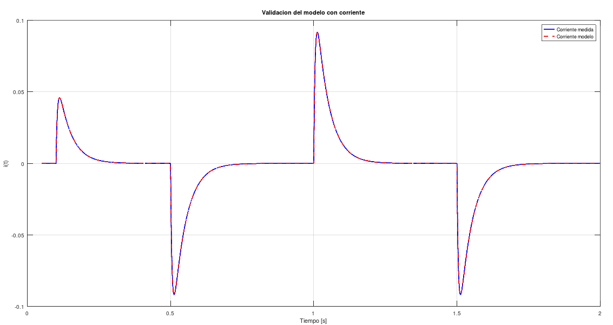
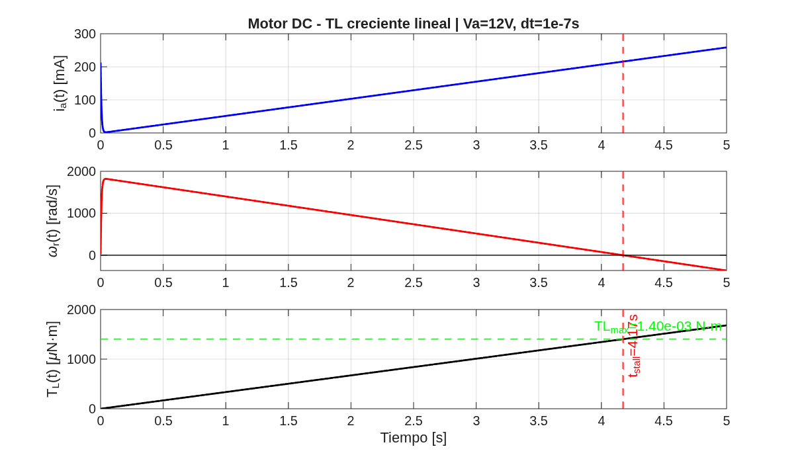
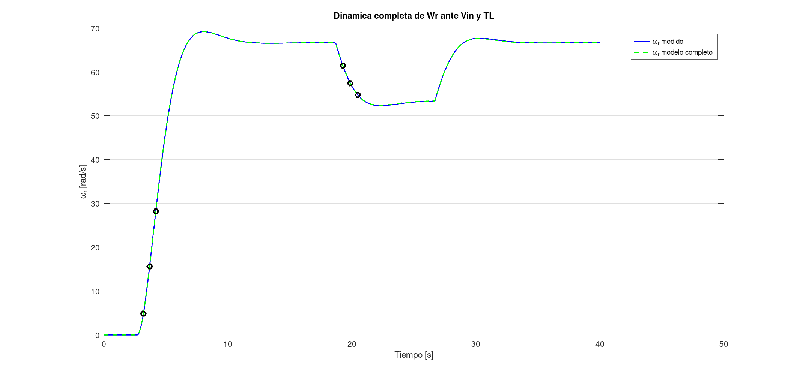
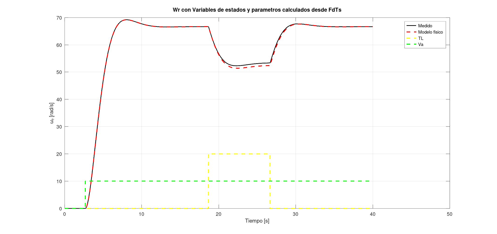

# Ítem 1

**Consigna:**

Asignar valores a R = 2200 Ohm, L = 500 mH y C = 10uF. Obtener simulaciones que permitan estudiar la dinámica del sistema, con una entrada de tensión escalón de 12V, que cada 10 ms cambia de signo.

**Implementación:**

Se definieron los parámetros del sistema según la consigna y constuyó el modelo en variables de estado, se generó su representación en espacio de estados utilizando la función `ss` junto con las matrices dadas. Luego, se construyó la señal de entrada y, finalmente, se simuló la respuesta del sistema mediante `lsim`, obteniendo la evolución temporal de las variables de estado y de la salida, y se representaron gráficamente los resultados. Como análisis complementario, se calcularon los autovalores de la matriz de estado para verificar la estabilidad del sistema.

**Resultados:**

Se logró la consigna propuesta.

---

# Ítem 2

**Consigna:**
Usando los datos de _Curvas_Medidas_RLC.xls_ deducir los valores de (R), (L) y (C) del circuito. Emplear el método de la respuesta al escalón (Chen), tomando como salida la tensión en el capacitor.

**Implementación:**
A partir de los datos medidos, se utilizó la tensión en el capacitor como salida del sistema y la señal de entrada correspondiente como excitación. Se identificó el instante de aplicación del escalón y se seleccionaron tres muestras equiespaciadas dentro del régimen transitorio. Con estos valores se aplicó el método de Chen para obtener las constantes de tiempo del sistema y construir una función de transferencia equivalente de segundo orden. A partir de sus coeficientes se determinaron las relaciones entre los parámetros físicos. La capacidad se obtuvo utilizando la relación entre corriente y variación temporal de la tensión del capacitor a partir de los datos experimentales, y posteriormente se calcularon los valores de resistencia e inductancia.

**Resultados:**

Se logró la consigna propuesta.

---

# Ítem 3

**Consigna:**
Una vez determinados los parámetros (R), (L) y (C), emplear la serie de corriente desde 0.05 s en adelante para validar el resultado superponiendo las gráficas.

**Implementación:**
Se utilizó el modelo en variables de estado obtenido con los parámetros identificados para simular la corriente del circuito frente a la señal de entrada medida. Se consideró el intervalo temporal a partir de (t = 0.05) s, distinto del utilizado en la identificación, y se superpusieron las curvas de corriente simulada y medida para evaluar la validez del modelo.

**Resultados:**

Se logró la consigna propuesta.

---

# Ítem 4

**Consigna:**
Analizar la dinámica de un motor de corriente continua ante una entrada de tensión constante y una carga mecánica variable.

**Implementación:**
Se modeló el motor de corriente continua considerando sus ecuaciones eléctricas y mecánicas, incluyendo la influencia del par de carga. Se aplicó una tensión constante de entrada y se definió un par de carga creciente lineal en el tiempo. A partir de este modelo se simularon las variables de interés: corriente de armadura, velocidad angular y par de carga. Se analizaron las condiciones de operación del sistema y se identificó el punto en el cual el motor alcanza su límite de funcionamiento.

**Resultados:**

Se logró la consigna propuesta.

---

# Ítem 5

**Consigna:**
Validar el modelo completo del motor comparando la respuesta simulada con datos medidos.

**Implementación:**
Se utilizó el modelo dinámico completo del motor, incorporando tanto la entrada de tensión como la variación del par de carga. Se simuló la evolución temporal de la velocidad angular y se comparó con los datos medidos del sistema real. La validación se realizó mediante la superposición de ambas señales, evaluando la correspondencia en régimen transitorio y estacionario.

**Resultados:**

Se logró la consigna propuesta. Tanto para Wr calculado con las dinamicas (Chen), como también en variable de estado calculando los parametros del motor con las dinamicas.

---

# Conclusión

El modelado en variables de estado y su implementación en herramientas computacionales permitió representar adecuadamente la dinámica de un sistema físico. A partir de datos experimentales, se logró identificar un modelo equivalente mediante el método de la respuesta al escalón y validar su comportamiento utilizando una variable distinta y en un intervalo temporal diferente, verificando la coherencia entre el modelo y el sistema real.

---

# Lecciones aprendidas

Se consolidó la capacidad de representar sistemas físicos mediante variables de estado, identificar modelos dinámicos a partir de datos experimentales y analizar su comportamiento temporal. Se desarrolló criterio para seleccionar variables de estado, interpretar respuestas al escalón y validar modelos mediante comparación con mediciones reales, integrando herramientas analíticas y computacionales en el estudio de sistemas lineales.
