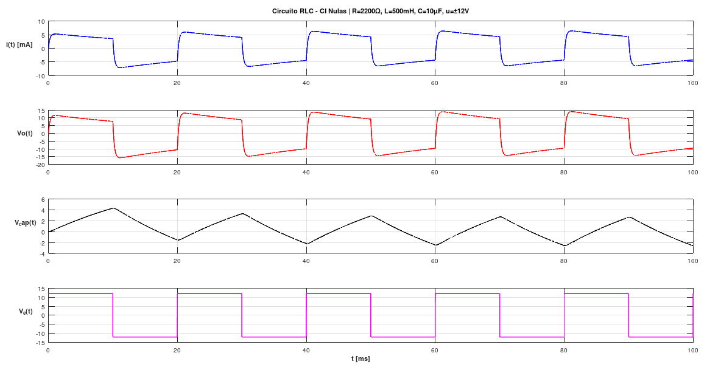

# Trabajo Práctico N°1 – Sistemas de Control II

## Ítem 1

**Consigna:**
Asignar valores a R = 2200 Ohm, L = 500 mH y C = 10uF. Obtener simulaciones que permitan estudiar la dinámica del sistema, con una entrada de tensión escalón de 12V, que cada 10 ms cambia de signo.

**Implementación:**
Se definieron los parámetros del sistema según la consigna y constuyó el modelo en variables de estado a partir de las ecuaciones dadas. Luego, se implementaron las matrices del sistema y se generó su representación en espacio de estados utilizando la función `ss` del paquete `control` en Octave. A continuación, se construyó la señal de entrada como un escalón alternante de amplitud ±12V con período de cambio de 10 ms. Finalmente, se simuló la respuesta del sistema mediante `lsim`, obteniendo la evolución temporal de las variables de estado y de la salida, y se representaron gráficamente los resultados.

Como análisis complementario, se calcularon los autovalores de la matriz de estado para verificar la estabilidad del sistema. Esto se hizo simplemente a modo de estudio de que los autovalores de la matriz de estados son igual a los polos de la FdT del sistema.

**Resultados:**

---

## Lecciones aprendidas

Se logró expresar un sistema físico en forma de variables de estado y analizar la evolución temporal a partir de simulaciones. Asimismo, se incorporó el uso de herramientas computacionales para validar modelos y estudiar la dinámica de sistemas lineales.

---

## Conclusiones

El modelado en variables de estado permite una representación estructurada de sistemas dinámicos y facilita su análisis mediante simulación. La implementación en Octave resultó adecuada para estudiar la respuesta del sistema frente a excitaciones variables en el tiempo.
